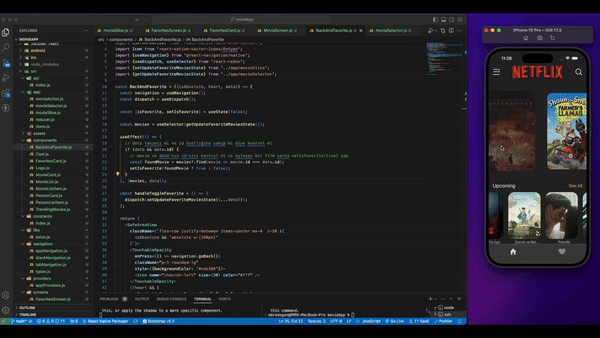

# Movie App

This project is a movie application developed using React Native. It fetches movie data from The Movie Database (TMDB) API, allowing users to view movie details, add to favorites, view favorite movies, and search for movies.

## Features

- Fetch movie data from TMDB API.
- Seamless navigation between screens.
- Marking favorite movies and viewing them.
- Movie search functionality.
- Modular API management using Redux Toolkit.

## Getting Started

To run the project locally, follow the steps below.

### Requirements

- [Node.js](https://nodejs.org/) (v14 or higher)
- [npm](https://www.npmjs.com/) or [Yarn](https://yarnpkg.com/)

### Installation

- Clone the project files to your computer.

  ```bash
  git clone https://github.com/your_username/movie-app.git
  ```

1. Navigate to the project directory and install dependencies.

cd movie-app
npm install

2. Update your TMDB API key in the src/config.js file.

// src/config.js

export const TMDB_API_KEY = 'your_tmdb_api_key';

3. Start the application.

npm start or yarn start


